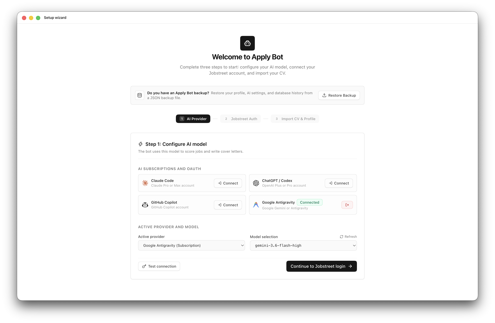
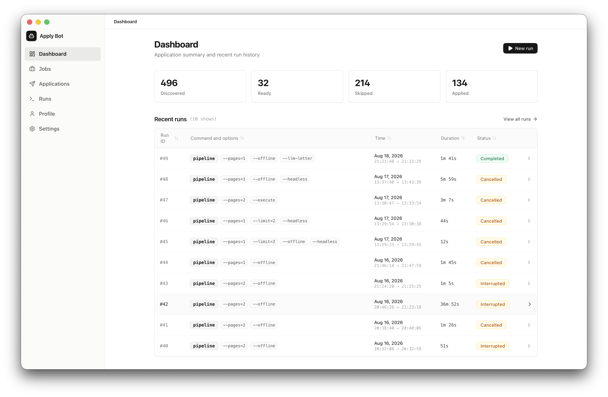

<div align="center">


# Apply Bot

**Automated job search, scoring pipeline, and application tracker for Jobstreet Indonesia.**

[](LICENSE)
[](https://www.python.org/downloads/)
[](https://fastapi.tiangolo.com)
[](https://react.dev)
[](https://www.electronjs.org)

Apply Bot automates job applications on Jobstreet Indonesia.
The tool scrapes listings, filters roles with rules, scores matches with AI, generates cover letters, and submits forms with Playwright.

[Downloads](https://github.com/Einzigart/apply-bot/releases) • [Features](#features) • [Pipeline architecture](#pipeline-architecture) • [Quick start](#quick-start) • [Desktop and web interface](#desktop-and-web-interface) • [CLI usage](#cli-usage) • [Configuration](#configuration) • [License](#license)

<br />



<br /><br />



</div>

---

## Features

- **Jobstreet Indonesia support.** Scrapes and applies to jobs on Jobstreet Indonesia.
- **Deterministic pipeline.** Scrapes and filters jobs with code rules before calling AI models.
- **Multiple AI providers.** Use API keys for OpenAI, Claude, Gemini, DeepSeek, Groq, and OpenRouter. You can also connect OAuth sessions from GitHub Copilot or Google.
- **Offline scoring.** Score jobs locally with keyword rules, or connect local endpoints such as Ollama and LM Studio.
- **Cover letter generator.** Creates customized cover letters that match your profile to job requirements.
- **Automated applications.** Fills application forms with Playwright, supports test runs, and saves browser login cookies.
- **Application tracker.**
  - **Status tracking.** Track stages including Submitted, Process, Interview, Offering, Declined, and Rejected.
  - **Manual entries.** Add offline applications and edit table rows inline.
  - **External jobs.** Save external job links and mark them as applied.
  - **Import and export.** Import and export data in Excel (.xlsx), CSV, and TSV formats. The tool skips duplicate records.
- **Web and desktop interface.** Includes a React interface and an Electron desktop app with a setup wizard, CV parser, and live run logs.
- **Local SQLite storage.** Stores all jobs, scores, metrics, and application history on your local machine.

---

## Pipeline architecture

```
┌─────────────┐     ┌─────────────┐     ┌─────────────┐     ┌─────────────┐     ┌─────────────┐
│  discover   │ ──► │   filter    │ ──► │    score    │ ──► │   letter    │ ──► │    apply    │
│  (scrape)   │     │   (rules)   │     │ (LLM/rules) │     │  (dynamic)  │     │(Playwright) │
│  0 tokens   │     │  0 tokens   │     │  text only  │     │  tailored   │     │  0 tokens   │
└─────────────┘     └─────────────┘     └─────────────┘     └─────────────┘     └─────────────┘
```

1. **Discover.** Scrapes job listings from Jobstreet Indonesia without LLM calls.
2. **Filter.** Applies deterministic rules for keywords, salary ranges, and company blacklists.
3. **Score.** Evaluates job fit using offline keyword rules or an AI model.
4. **Letter.** Writes custom cover letters for shortlisted positions from your CV data.
5. **Apply.** Fills and submits application forms with Playwright.

---

## Quick start

### Prerequisites

- Python 3.11 or higher
- [uv](https://docs.astral.sh/uv/) or `pip`
- [Bun](https://bun.sh) to build the UI and Electron app

### Installation

```bash
# Clone the repository
git clone https://github.com/Einzigart/apply-bot.git
cd apply-bot

# Install dependencies with uv
uv sync

# Install the Playwright browser
uv run playwright install chromium

# Copy configuration templates
cp data/profile.example.yaml data/profile.yaml
cp data/secrets.example.yaml data/secrets.yaml
```

---

## Desktop and web interface

### Desktop app (Electron)

```bash
# Start the desktop app in development mode
cd electron
bun install
bun run dev

# Build the desktop package
bun run build
bun run package
```

> **First launch instructions:**
> - **macOS:** macOS may show an unidentified developer prompt because the app is not notarized.
>   1. Open **System Settings > Privacy & Security**.
>   2. Scroll to **Security** and click **Open Anyway**.
>   You can also run `xattr -cr "/Applications/Apply Bot.app"` in your terminal.
> - **Windows:** If SmartScreen appears:
>   - Option A: Right-click the `.zip` file, open **Properties**, select **Unblock**, and click **OK**.
>   - Option B: In the SmartScreen dialog, click **More info**, then click **Run anyway**.

### Web application server

Run the FastAPI backend and web interface:

```bash
uv run python -m src.run serve --port 5139
```

Open `http://localhost:5139` to view:
- **Dashboard.** Review real-time metrics and application counts.
- **Job list.** Filter, inspect, and approve job postings.
- **Setup wizard.** Upload a CV in PDF format to extract profile details.
- **Settings.** Configure API keys, select models, and manage logins.
- **Run runner.** Start pipeline runs, view logs, and cancel active jobs.

---

## CLI usage

### 1. Interactive login
Log in once to save your browser cookies to `data/storage_state.json`:

```bash
uv run python -m src.run login
```

### 2. Discover jobs
Scrape search listings and job descriptions:

```bash
uv run python -m src.run discover --pages 2
```

### 3. Score shortlisted jobs
Evaluate job fit with offline rules or an AI model:

```bash
# Offline scoring without AI tokens
uv run python -m src.run score --offline

# AI scoring
uv run python -m src.run score
```

### 4. Review borderline queue
Inspect and decide on jobs flagged for manual review:

```bash
uv run python -m src.run review
```

### 5. Submit applications

```bash
# Test run: fill forms without submitting
uv run python -m src.run apply

# Live run: submit applications
uv run python -m src.run apply --execute
```

### 6. Full end-to-end pipeline

```bash
uv run python -m src.run pipeline --pages 2
```

---

## Configuration

Configuration files are located in `data/`:

| File | Description | Committed to Git |
| --- | --- | --- |
| `data/config.example.yaml` | Search and scraping template | Yes |
| `data/profile.example.yaml` | Profile template | Yes |
| `data/secrets.example.yaml` | API keys template | Yes |
| `data/config.yaml` | Search queries and filters | No (ignored) |
| `data/profile.yaml` | Profile details and answers | No (ignored) |
| `data/secrets.yaml` | API keys and credentials | No (ignored) |
| `data/jobs.db` | SQLite database for jobs and runs | No (ignored) |
| `data/storage_state.json` | Saved browser session cookies | No (ignored) |

---

## Privacy and safety

- **No random inputs.** If a form has unknown fields or unexpected screens, the bot saves a screenshot to `logs/` and skips the job.
- **Local storage.** All credentials, CV files, and database records stay on your local computer.

---

## License

This project is licensed under the Apache 2.0 License. See [LICENSE](LICENSE) for details.
